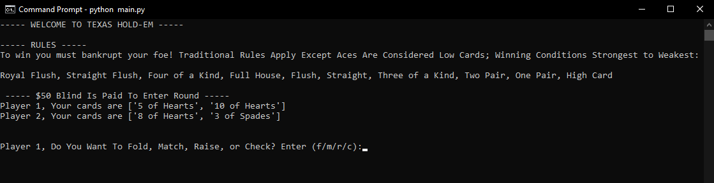
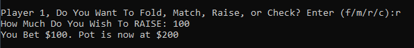
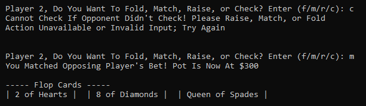
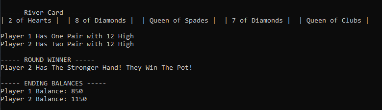

# TexasHoldem
Python based console poker app using the rules of Texas Hold'em

## Features
- includes 2 player games with starting balance of $1000 (bets are $50 minimum)
- custom betting system with all traiditional poker calls (fold, match, raise, and check)
- custom winning algorithms to determine the winning hand

## Example Gameplay

Starting The Game
 

Player Options/Moves
 

End Screen
 

